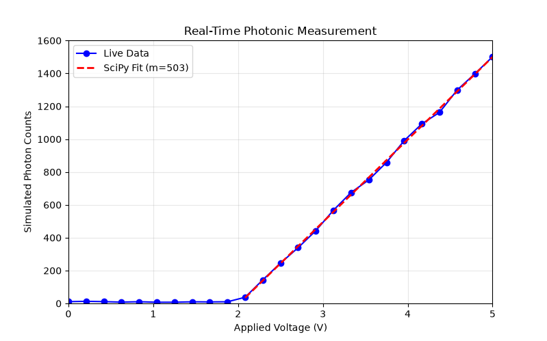

<!-- # pyvisa-playground -->
<h1 align="center"> Mock laser controller</h1>

## Project Description
### A simple description
This is a project sets up a fake laser which is connected to my computer. I perform a voltage sweep, (set a starting voltage, increase it by small steps till i reach target voltage). Everytime i receive the current voltage, to simulate real conditions, I add some noise. I calculate the number of photons which could have been emitted with that voltage, and plot those. I try to extract the slope of the graph just from the data which I plotted. 

### More technical description

This project implements a modular, hardware driver(LaserController) to manage SCPI-based communication over a virtual serial port. The experimental sequence runs a continous parameter sweep while polling the instrument state. To emulate realistic hardware, the simulated detector response includes a threshold of 2 V, below only Gaussian noise is registered. Above the threshold, the number of photons scales linearly with the voltage set. Realtime visualization is handled using matplotlib and SciPy predicts the slope of the data(photons vs volt) above threshold. 


## Libraries used
1. **PyVISA-sim**: Provides a simulated backend via YAML configuration to emulate instrument memory states and hardware responses.
2. **PyVISA**: To manage hardware resources and handle SCPI-based serial communication (RS-232) with the instrument.
3. **NumPy**: Generates the linear parameter sweep arrays and injects Gaussian noise to simulate physical dark counts and photon shot-noise. 
4. **Pandas**: Structures the acquired experimental data into DataFrames for robust serialization and CSV logging.
5. **SciPy**: Utilizes curve_fit to perform linear regression on the active lasing region, to extract the slope.
6. **Matplotlib**: for real time visualization of the data generated as the parameter sweep executes


## Installation & Usage

### 1. Install Dependencies
```bash
pip install -r requirements.txt
```
and then run the main program.
```
python3 main.py
```

An example plot
